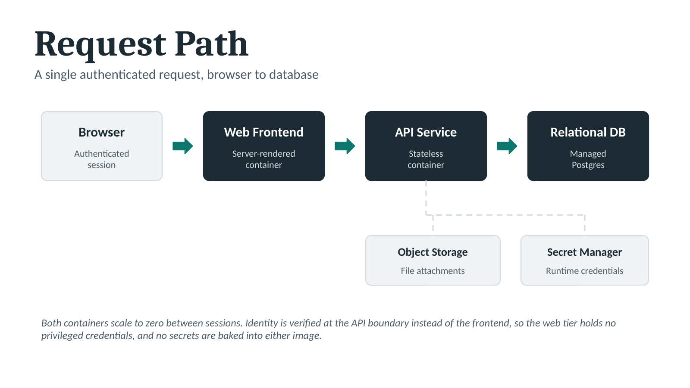
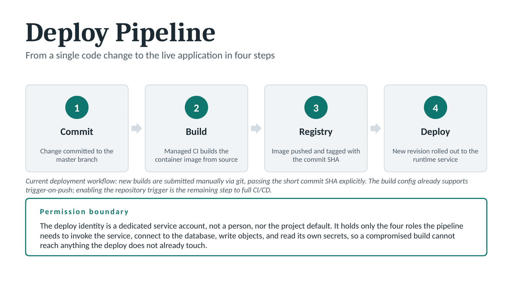
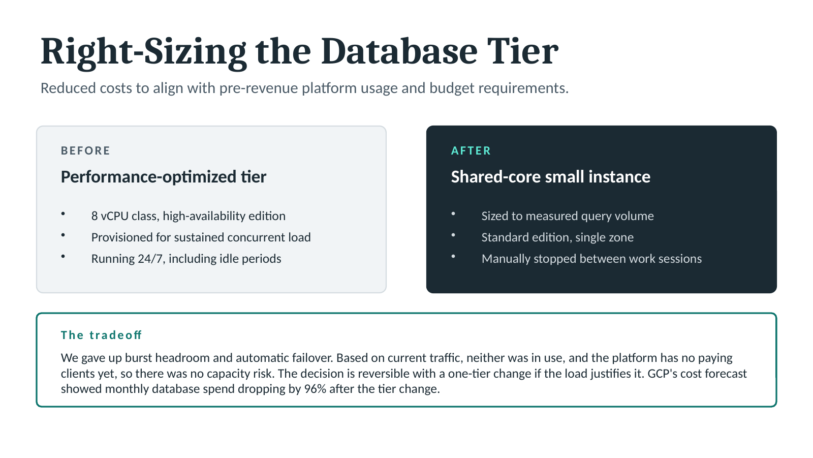

# Architecture Documentation Sample

Three slides documenting a production SaaS platform running on Google Cloud: how a
request travels through the system, how code reaches production, and how the database
tier was sized against measured workload.

Built to communicate to two audiences at once. An engineer should find it accurate,
and a non-technical stakeholder should be able to follow it without a glossary.

Client-specific identifiers (project names, service names, regions, credentials) have
been removed. The architecture patterns and decisions are described generically.

---

## 1. Request Path

A single authenticated request from browser to database, with the supporting services
shown as dependencies instead of using request flow. The trust boundary sits at the API
service, not the frontend.

## 2. Deploy Pipeline

Commit to running container in four steps, with the permission boundary of the deploy
identity called out. The current-state note calls what is not yet automated trigger
on push is configured but not enabled because a system document that only describes
the intended state is not much use to the next engineer.

## 3. Right-Sizing the Database Tier

An inherited enterprise-default database configuration, evaluated against actual query
volume and moved to a smaller tier. The slide states what was given up instead of only
mentioning what was saved, since the tradeoff is the part worth reviewing.

---

## Source file

[`Architecture_Application.pptx`](Architecture_Application.pptx) — the editable
PowerPoint. Every diagram is built from native vector shapes versus using imported
images, so shapes, text, and color can be edited directly.

**Design notes.** Meaning is carried by fill contrast (dark versus light) over
hue, so the diagrams stay readable in grayscale and for readers with color vision
deficiency. Colour reinforces but never differentiates on its own. Palette is limited
to two tones plus neutrals; body text meets WCAG AA contrast against its background.

---

Brennan Maxwell · [linkedin.com/in/brennanmaxwell](https://linkedin.com/in/brennanmaxwell)
